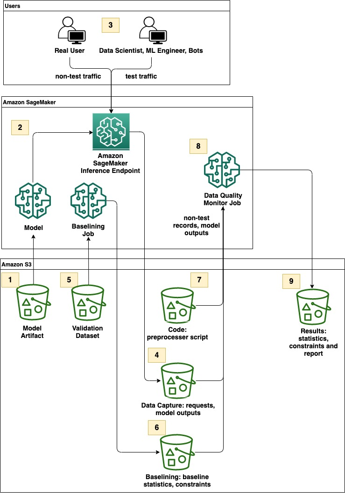

# Amazon SageMaker Model Monitor - Design a compelling record filtering method using custom preprocessing script

Continuous model monitoring can provide information on how the model is performing in the production. The monitoring outputs are used to identify the problems proactively and take corrective actions, such as model retraining and updating, to help stabilize the model in production. However, in a real-world production setting, multiple personas may interact with the model, including real-users, engineers who are trouble-shooting production issues, or bots conducting performance tests. In such a scenario, additional mechanisms may be required. This solution demonstrate how to build a record filtering method based on sets of business criteria as part of preprocessing step in SageMaker Model Monitoring. The goal is to ensure only the target records are sent to downstream analysis steps to avoid false positive detection of violations. 

**Contents:**

* **[Solution Overview](#solution-overview)**
* **[AWS Service Requirements](#aws-service-requirements)**
* **[Environment Setup](#environment-setup)**
* **[Deploy Pre-Trained XGBoost Model with Script-Mode](#deploy-pre-trained-xgboost-model-with-script-mode)**
* **[Implement a Filtering Mechanism in Preprocessor Script](#implement-a-filtering-mechanism-in-preprocessor-script)**
* **[Create SageMaker Model Monitoring Schedule (Data Quality only)](#create-sagemaker-model-monitoring-schedule-data-quality-only)**
* **[Test Scenarios](#test-scenarios)**
* **[Cleanup](#cleanup)**

## Solution Overview
<p align="center">

</p>

1. Model Artifact bucket contains model.tar.gz, the XGBoost churn prediction model pre-trained on publicly available dataset mentioned in the book [Discovering Knowledge in Data by Daniel T. Laros](https://www.amazon.com/dp/0470908742/). If you are interested in how this model artifact was trained offline, you can see [Customer Churn Prediction with XGBoost notebook](https://github.com/aws/amazon-sagemaker-examples/blob/master/introduction_to_applying_machine_learning/xgboost_customer_churn/xgboost_customer_churn.ipynb) example on GitHub repo. 
2. The model is deployed to inference endpoint with [data capture enabled](https://docs.aws.amazon.com/sagemaker/latest/dg/model-monitor-data-capture.html)
3. Different personas send model prediction request traffic to the endpoint
4. Data Capture bucket will be used to store capture data from requests and responses
5. Validation Dataset buckets contain the validation dataset required to create a baseline from a validation dataset in Model Monitoring.
6. Baselining bucket will be used to store the output files for dataset statistics and constraints from Model Monitoring's baselining job
7. Code bucket contains a custom preprocessor script for Model Monitor
8. [Model Monitor Data Quality](https://docs.aws.amazon.com/sagemaker/latest/dg/model-monitor-data-quality.html) executes a monitoring job 
9. Results bucket contains outputs of monitoring job including statistics, constraints, and violations report

### Pre-requisites

 1. Pyton 3.7 or greater
 2. [Amazon SageMaker Studio](https://aws.amazon.com/sagemaker/studio/)
 3. [Amazon SageMaker Python 3 (Data Science) Kernels](https://docs.aws.amazon.com/sagemaker/latest/dg/notebooks-available-kernels.html)
 4. [AmazonSageMakerFullAccess](https://docs.aws.amazon.com/sagemaker/latest/dg/security-iam-awsmanpol.html) (you can further restrict this to least privileges based on your use case)

- - -

## AWS Service Requirements

The following AWS services are required for this utility:

 1. [Amazon SageMaker](https://aws.amazon.com/sagemaker)
 2. [Amazon S3](https://aws.amazon.com/s3/)
 5. [AWS IAM](https://aws.amazon.com/iam)
 
## Environment Setup
   1. Open the [AWS Management Console](https://console.aws.amazon.com/console/)
   2. Launch SageMaker Studio from AWS Management Console
       * If you have not created Amazon SageMaker Studio in your account yet, you can either manually create one by following [Onboard to Amazon SageMaker Studio - Quick Start](https://docs.aws.amazon.com/sagemaker/latest/dg/onboard-quick-start.html)
       * Alternatively, you can follow the blog, [Creating Amazon SageMaker Studio domains and user profiles using AWS CloudFormation](https://aws.amazon.com/blogs/machine-learning/creating-amazon-sagemaker-studio-domains-and-user-profiles-using-aws-cloudformation/) which walks you through how to deploy CloudFormation that automates a creation of SageMaker Studio in your account.
   3. Launch a New Terminal within Studio (Go to File > Terminal)
   4. Clone this GitHub Repo in the Terminal: cd ~ && git clone https://gitlab.aws.dev/kennysat/data_quality_monitor_custom_preprocessing.git
   5. Navigate to sagemaker_model_monitor/data_quality_custom_preprocessing in SageMaker Studio
   6. Open [Data_Quality_Custom_Preprocess_Churn.ipynb](./Data_Quality_Custom_Preprocess_Churn.ipynb)
   7. Select afforementioned Data Science Kernel and ml.t3.medium as an instance type to host the notebook to get started

[Data_Quality_Custom_Preprocess_Churn.ipynb](./Data_Quality_Custom_Preprocess_Churn.ipynb) walks you through the rest of the steps. You can choose to go directly to the code and walk through with the notebook or you can continue reading as there are some supplemental info which may not be mentioned in the notebook.

## Deploy Pre-Trained XGBoost Model with Script-Mode
Since the model was trained offline using XGBoost, we use `XGBoostModel` from SageMaker SDK to deploy the model. We provide the inference entry point in the source directory since we have a custom input parser for JSON requests and re-formatting output using `Flask` for the response. The following are the custom `input_fn` and `output_fn`. 

```python
def input_fn(request_body, request_content_type):
    """
    The SageMaker XGBoost model server receives the request data body and the content type,
    and invokes the `input_fn`.
    Return a DMatrix (an object that can be passed to predict_fn).
    """
    if request_content_type == "text/libsvm":
        return xgb_encoders.libsvm_to_dmatrix(request_body)
    elif request_content_type == "text/csv":
        return xgb_encoders.csv_to_dmatrix(request_body.rstrip("\n"))
    elif request_content_type == "application/json":
        request = json.loads(request_body)
        feature = ",".join(request.values())
        return xgb_encoders.csv_to_dmatrix(feature.rstrip("\n"))
    else:
        raise ValueError("Content type {} is not supported.".format(request_content_type))

def output_fn(predictions, content_type):
    """
    After invoking predict_fn, the model server invokes `output_fn`.
    """
    print(predictions)
    if content_type == "text/csv":
        result = ",".join(str(x) for x in predictions)
        return Response(result, mimetype=content_type)
    elif content_type == "application/json":
        result = json.dumps(predictions.tolist())
        return Response(result, mimetype=content_type)
    else:
        raise ValueError("Content type {} is not supported.".format(content_type))

```
The below is a sample payload which is used to invoke a real-time endpoint. 
```json
{
	"Account Length": "134",
	"VMail Message": "500",
	"Day Mins": "2.5553671354794947",
	"Day Calls": "2",
	"Eve Mins": "0.1370484071345021",
	"Eve Calls": "3",
	"Night Mins": "5.550331656408224",
	"Night Calls": "300",
	"Intl Mins": "7.097685494397488",
	"Intl Calls": "7",
	"CustServ Calls": "8",
	"State_AK": "0",
	"State_AL": "0",
	"Area Code_877": "0",
	"Area Code_878": "0",
	"Int'l Plan_no": "1",
	"Int'l Plan_yes": "0",
	"VMail Plan_no": "0",
	"VMail Plan_yes": "1"
}
```
we want to exclude test inference records from downstream monitoring analysis. You can implement a rule-based filtering mechanism by parsing metadata provided in CustomAttributes in a request header. The below code illustrates how to send custom attributes as key-value pairs using [Boto3 SageMaker Runtime Client](https://boto3.amazonaws.com/v1/documentation/api/latest/reference/services/sagemaker-runtime.html). We recommend utilizing `CustomAttributes` to send required metadata for simplicity. Depending on your preference and requirements, you can choose to include metadata as part of inference records as long as your entry point inference reflect the change and extraction of input features in input records doesn't break. 

```python
custom_attributes = {
    "testIndicator": testIndicator,
    "applicationName":"DEMO",
    "transactionId":1,
}
response = runtime_client.invoke_endpoint(
    EndpointName=endpoint_name, 
    ContentType='application/json', 
    Body=json.dumps(payload),
    CustomAttributes=json.dumps(custom_attributes), 
)
```
The sample data capture file for the above inference invocation is shown below. 

```json
{
	"captureData": {
		"endpointInput": {
			"observedContentType": "application/json",
			"mode": "INPUT",
			"data": "{\"Account Length\": \"134\", \"VMail Message\": \"500\", \"Day Mins\": \"2.5553671354794947\", \"Day Calls\": \"2\", \"Eve Mins\": \"0.1370484071345021\", \"Eve Calls\": \"3\", \"Night Mins\": \"5.550331656408224\", \"Night Calls\": \"300\", \"Intl Mins\": \"7.097685494397488\", \"Intl Calls\": \"7\", \"CustServ Calls\": \"8\", \"State_AK\": \"0\", \"State_AL\": \"0\",
            \"Area Code_877\": \"0\", \"Area Code_878\": \"0\", \"Int'l Plan_no\": \"1\", \"Int'l Plan_yes\": \"0\", \"VMail Plan_no\": \"0\", \"VMail Plan_yes\": \"1\"}",
			"encoding": "JSON"
		},
		"endpointOutput": {
			"observedContentType": "application/json",
			"mode": "OUTPUT",
			"data": "[0.008645681664347649]",
			"encoding": "JSON"
		}
	},
	"eventMetadata": {
		"eventId": "960f9337-414e-4f4c-8acd-d6a8359e667c",
		"customAttributes": ["{\"testIndicator\": \"true\", \"applicationName\": \"DEMO\", \"transactionId\":\"001\"}"],
		"inferenceTime": "2021-08-27T20:44:27Z"
	},
	"eventVersion": "0"
}
```

## Implement a Filtering Mechanism in Preprocessor Script

As illustrated in the code below, we extend the built-in mechanisms of Model Monitor by providing a custom preprocessor function that does the following. First, we extract `testIndicator` information from custom attributes and use this information to set `is_test` variable to either `True`, when it’s a test record, or `False` otherwise. If we want to skip test records without breaking a monitor job, we can return `[]` to indicate that the object is an empty set of rows. Note that returning `{}` will result in an error because it is considered as an object having an empty row which SageMaker doesn't expect. Moreover, with non-test records, the function will return a key-value pair consisting of zero-padded index numbers and corresponding input features. This is done to avoid any misalignment of input features caused by key-sorting in the downstream process. As a side note, SageMaker applies this preprocessing function for each inference record in captured data and aggregates the results on your behalf.

```python
def preprocess_handler(inference_record):
    #*********************
    # a single inference implementation
    #*********************
    input_enc_type = inference_record.endpoint_input.encoding
    input_data = inference_record.endpoint_input.data.rstrip("\n")
    output_data = get_class_val(inference_record.endpoint_output.data.rstrip("\n"))
    eventmedatadata = inference_record.event_metadata
    custom_attribute = json.loads(eventmedatadata.custom_attribute[0]) if eventmedatadata.custom_attribute is not None else None
    is_test = eval_test_indicator(custom_attribute) if custom_attribute is not None else True
    
    if is_test:
        return []
    elif input_enc_type == "CSV":
        outputs = output_data+','+input_data
        return {str(i).zfill(20) : d for i, d in enumerate(outputs.split(","))}
    elif input_enc_type == "JSON":  
        outputs = {**{LABEL: output_data}, **json.loads(input_data)}
        write_to_file(str(outputs), "log")
        return {str(i).zfill(20) : outputs[d] for i, d in enumerate(outputs)}
    else:
        raise ValueError(f"encoding type {input_enc_type} is not supported") 
```

At the time of writing this documentation, preprocessing step in Model Monitor does not publish any logs to CloudWatch although this may change in future. If you need to debug your custom preprocessing script, you may want to write and save your own logs inside the container under the directory, `/opt/ml/processing/output/` so that you can access it later in your S3 bucket.


### Create SageMaker Model Monitoring Schedule (Data Quality only)
We create baseline constraints, statistics, and model monitoring schedule for deployed endpoint in one go using a custom wrapper class, `MonitorWithoutGroundTruth`. Under the hood, `DefaultModelMonitor.suggest_baseline` method triggers a processing job with a managed Model Monitor container with Apache Spark and the AWS Deequ library to generate the constraints and statistics as a baseline. After the baselining job completes, `DefaultModelMonitor.create_monitoring_schedule` method creates a monitor schedule.

```python
demo_mon = DemoDataQualityModelMonitor(
    endpoint_name=current_endpoint_name, 
    bucket=bucket,
    projectfolder_prefix=prefix,
    training_dataset_path=s3_train_data_uri,
    record_preprocessor_script=s3_record_preprocessor_uri,
    post_analytics_processor_script=None,
    kms_key=None,
    subnets=None,
    security_group_ids=None,
    role=role,
    tags=tags
)
my_monitor = demo_mon.create_data_quality_monitor()
```

## Test Scenarios
We can test the following two scenarios to confirm that the filtering is working as expected. The first scheduled monitor execution won't be triggered until at least an hour after creating the schedule, so you can either wait or manually start a monitoring job using preprocessing. We will use a latter approach for convenience. Fortunately, a utility tool already exists for this purpose and is available in this [Github repo](https://github.com/aws-samples/reinvent2019-aim362-sagemaker-debugger-model-monitor/tree/master/02_deploy_and_monitor). We also provided a wrapper method, `ArtificialTraffic.generate_artificial_traffic`, which users can pass column names and predefined static methods to populate bogus inputs and monotonically increases transactionId each time the endpoint is invoked. 

First Scenario: 
   1. Send a record that we know it won't trigger any violations. To do this, you can use a provided method, `generate_artifical_traffic` and set `config` variable to False. Also set the `testIndicator` in custom attributes to `false` to indicate that it’s not a test record. 
   2. Send another record that would actually trigger a violation. This time, we pass a set of dictionaries in `config` variable to create bogus input features as shown below, and also set `testIndicator` to `true` to skip this record for the analysis. 
   3. Manually kick off a monitor job using `run_model_monitor_job_processor` method from the imported utility class and provide parameters such as s3 locations for baseline files, data capture, preprocessor script, and other info.
   4. In outputs of Monitor, confirm that `constraint_violations.json` shows `violations: [] 0 items` and `dataset: item_count:` in `statistics.json` shows `1`, instead of `2`. 
   5. This would confirm that Model Monitor has analyzed only the non-test record.

Second Scenario:        
   1. Send N records that we know that would trigger violations such as `data_type_check` and `baseline_drift_check`. set the `testIndicator` in custom attributes to `false`. 
   2. In Monitor outputs, confirm that `constraint_violations.json` shows `violations: [] 2 items` and `dataset: item_count:` in `statistics.json` shows `1001`. An extra item is a carry over from the first scenario testing so this is expected.  
   3. This would confirm that sending test records as inference records would trigger false positive violations if `testIndicator` is not set correctly.

## Cleanup

We can delete the model monitoring schedule and endpoint we created earlier. You could wait until the first monitor schedule kicks off; the result should be similar to what we confirmed from testing. If you are interested, you could also experiment with other testing scenarios. When you are done, you can execute the following code to delete the monitoring schedule and endpoint.

```python
my_monitor.delete_monitoring_schedule()
sm.delete_endpoint(EndpointName=current_endpoint_name)
```

Don’t forget to shutdown resources by stopping running instances/apps following the instructions provided in this [documentation](https://docs.aws.amazon.com/sagemaker/latest/dg/notebooks-run-and-manage-shut-down.html) to avoid incurring charges from SageMaker.
